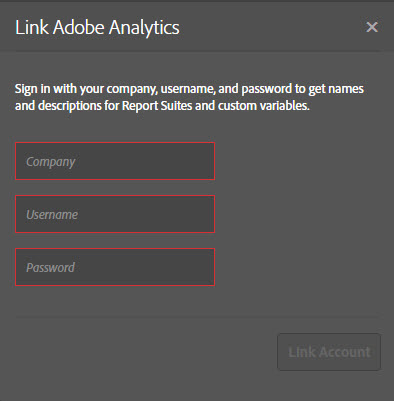

# “解决方案”选项卡{#solution-tabs}

单击“解决方案”选项卡，可查看特定 Adobe Experience Cloud 解决方案的结果。

## Analytics {#section-f71dfcc22bb44c86bec328491606a482}

“Analytics”选项卡提供有关您的 [Analytics](https://docs.adobe.com/content/help/zh-Hans/analytics/landing/home.html) 实施的信息。

**点击量**

默认情况下，对同一报表包进行的所有服务器调用都会被折叠。

**下载：**&#x200B;以 Excel 电子表格形式下载所有显示的报表包的相关信息。

**清除所有请求：**&#x200B;从 Analytics 视图中删除所有显示的请求。清除请求后，新请求将在发生时显示。

单击报表包 ID 可展开视图：

此屏幕显示自打开Adobe Experience Platform调试器或清除请求以来的所有请求。 默认参数会自动映射到友好名称。如果使用“链接 Analytics”功能进行身份验证（请参阅下文），[Prop 和 eVar](https://docs.adobe.com/content/help/zh-Hans/analytics/implementation/vars/page-vars/evar.html) 变量可以映射到您的自定义友好名称（例如，“prop1”可以显示为“用户类型”）。将按从左到右的顺序显示请求。

**下载：**&#x200B;以 Excel 电子表格形式保存所有对报表包发出的请求。

**清除请求：**&#x200B;移除对此报表包发出的所有请求。新请求将在发生时显示。

**关联帐户（旧版）**

Click **[!UICONTROL Link Account]**, then enter the requested information to link an Analytics account to the Platform Debugger.

>[!NOTE]
>
>目前，仅旧版 Analytics 用户登录凭据支持此功能。

**检索处理后的点击量**

如果要在运行处理规则之后查看 Analytics 点击量值，请启用“检索处理后的点击量”选项。您必须登录到 Adobe Experience Cloud 才能使用此功能。

启用此选项后，将向 Analytics 请求添加一个调试参数。将会像任何其他点击量一样继续处理此点击量。平台调试器轮询Analytics调试API，以检索具有原始点击ID的任何点击的后处理规则值。 后处理点击量具有紫色背景，显示在原始点击量旁边。

对于大多数 Analytics 实施，在几分钟内即可获得后处理规则信息。Analytics for Target (A4T) 实施所需的时间则要长很多。

## Target {#section-988873ba5ede4317953193bd7ac5474c}

使用“Target”选项卡可查看 [Target](https://docs.adobe.com/content/help/zh-Hans/target/using/target-home.html) 请求或 [Mbox 追踪](https://docs.adobe.com/content/help/zh-Hans/target/using/activities/troubleshoot-activities/content-trouble.html)响应详细信息。

单击 **[!UICONTROL Requests]**，然后展开环境可查看有关 Target 的信息。

单击 **[!UICONTROL Clear All Requests]** 可删除当前显示的请求。将在发出请求时显示更多请求。

您还可以使用 Target 筛选器[为 Target 调试启用 MBox 追踪](https://docs.adobe.com/content/help/zh-Hans/target/using/activities/troubleshoot-activities/content-trouble.html)。

您必须有一个已通过 Experience Cloud 身份验证且已打开的 Chrome 选项卡，才能启用 Mbox 追踪。启用后，将显示您的 Adobe ID 用户名。展开您的用户名，以显示与您有权访问的 Experience Cloud 组织有关的 Target 客户端代码。单击要为其启用 Mbox 追踪的客户端代码，并确认出现绿色复选标记。现在将显示所有包含 Mbox 追踪信息的 Target 请求，并按客户端代码分组。要浏览 Mbox 追踪信息，请展开请求以查看相关选项卡：

* [活动](https://docs.adobe.com/content/help/zh-Hans/target/using/activities/activities.html)“活动”选项卡显示与 Target 请求名称关联的所有活动，无论您是否符合活动条件均是如此。“匹配的活动”是您符合条件的活动，响应时会提供其选件。您可以展开活动名称以确认您所在的体验，以及哪些受众和定位条件使您有资格参与活动。“评估的活动”包含所有已经评估的活动，无论您是否符合条件。要了解为什么您不符合某个“已评估”但不“匹配”的活动的条件，请展开活动名称并查看“不匹配的受众”部分。

* 请求

   [Mbox 追踪](https://docs.adobe.com/content/help/zh-Hans/target/using/activities/troubleshoot-activities/content-trouble.html)的“请求”选项卡类似于主要请求选项卡。除了请求标头外，您还可以查看 Target 请求传递的所有参数。
* 配置文件

   展开“配置文件快照”部分，查看您以访客身份存储在 Target 配置文件数据库中的[配置文件信息](https://docs.adobe.com/content/help/zh-Hans/target/using/audiences/visitor-profiles/variables-profiles-parameters-methods.html)。此处将显示所有 Mbox 内配置文件和脚本配置文件，以及一些系统配置文件。“状态”列显示在此请求范围内更改了哪些配置文件，以及这些配置文件在请求进入配置文件系统之前和之后的值。
* Audience Manager

   “Audience Manager”选项卡的“segmentIds”和“cachedSegmentIds”部分显示从 Experience Cloud 共享到 Target，并且您符合条件的[受众](https://docs.adobe.com/content/help/zh-Hans/target/using/audiences/target.html)的 ID。这些受众可以是在 Audience Manager、Analytics 或在 People Core Service 的受众生成器中创建的受众。可以在 Audience Manager 用户界面中查找这些 ID，以查找受众名称。

以下视频演示了 Target 的一般功能：

>[!VIDEO](https://video.tv.adobe.com/v/23115t2/)

以下视频演示了 Mbox 追踪：

>[!VIDEO](https://video.tv.adobe.com/v/23113t2/)

## Audience Manager {#section-1d4484f8b46f457f859ba88039a9a585}

可以使用 [Audience Manager](https://docs.adobe.com/content/help/zh-Hans/audience-manager/user-guide/aam-home.html) 选项卡查看[事件](https://docs.adobe.com/content/help/zh-Hans/audience-manager/user-guide/api-and-sdk-code/dcs/dcs-event-calls/dcs-event-calls.html)的详细信息。单击组织可将其展开并显示相关信息。

单击 **[!UICONTROL Clear All Events]** 可重置显示的信息。新事件将在发生时显示。

**ID 同步**

ID 同步是入站异步数据传输过程中的第一步。在此步骤中，Audience Manager 和供应商将比较并匹配各自站点访客的 ID。

有关[入站数据传输的 ID 同步](https://docs.adobe.com/content/help/zh-Hans/audience-manager/user-guide/implementation-integration-guides/sending-audience-data/batch-data-transfer-process/id-sync-http.html)详细信息，请参阅 Audience Manager 产品文档。

## Advertising Cloud {#section-ee80a9c509f2462c89c1e5bd8d05d7c8}

可以使用“Advertising Cloud”选项卡查看 Advertising Cloud 请求。

单击 **[!UICONTROL Requests]**，然后展开环境可查看有关 Advertising Cloud 的信息。

单击 **[!UICONTROL Clear All Requests]** 可删除当前显示的请求。将在发出请求时显示更多请求。

## Experience Cloud ID 服务 {#section-a96c32f8e63a4991abb296f6e8ea01cf}

可以使用“Experience Cloud ID 服务”选项卡查看 [Experience Cloud ID 服务](https://docs.adobe.com/content/help/zh-Hans/id-service/using/home.html)请求。

单击 **[!UICONTROL Requests]**，然后展开环境可查看有关 Experience Cloud ID 服务的信息。

单击 **[!UICONTROL Clear All Requests]** 可删除当前显示的请求。将在发出请求时显示更多请求。
