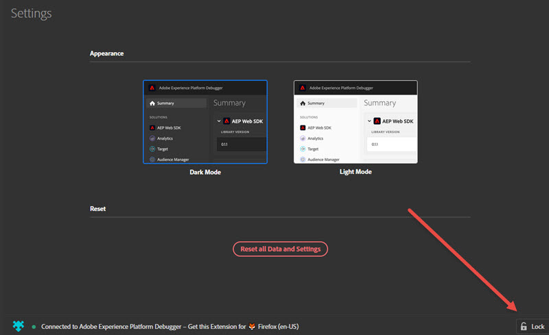

# 配置 Debugger

>[!IMPORTANT]
>
>Adobe Experience Platform Debugger 目前为 Beta 版。文档和功能可能会发生变化。

您可以在外观和工作方式上，对 Experience Platform Debugger 进行某些方面的配置。

## 浅色或深色模式

在 Experience Platform Debugger 打开后，您可以通过转到 **[!UICONTROL Settings]** 并选择&#x200B;**深色模式**（默认选项）或&#x200B;**浅色模式**&#x200B;来选择首选外观。

## 重置

单击 **[!UICONTROL Reset all Data and Settings]** 可返回到清除所有数据并恢复默认设置的状态。

## 将 Experience Platform Debugger 锁定在某个页面上

当您在网站上变更页面时，Experience Platform Debugger 窗口会随之更新，以显示相应页面的信息。在屏幕底部，将显示您所连接的页面的名称。若要将 Experience Platform Debugger 锁定在某个页面上，请单击 Experience Platform Debugger 窗口右下角的 **[!UICONTROL Lock]**。

如果您在调试页面的同时还需要阅读文档或查看其他页面的信息，那么这项操作会比较实用。